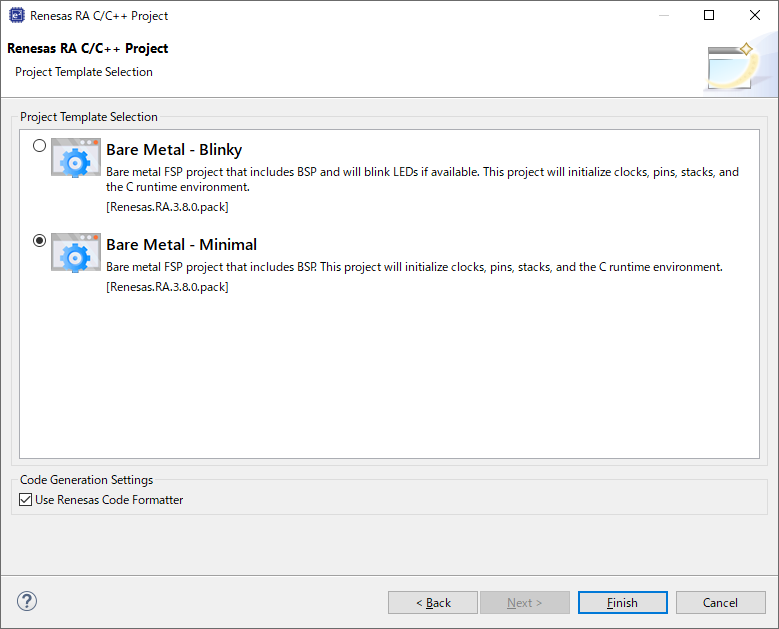
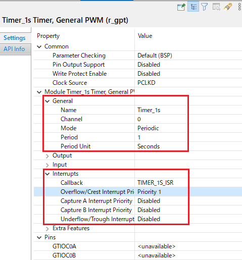

# GPIO

1. Create new Project. (Option: Bare Metal-Minimal)

    .
2. Set LED and Timer
    * LED PINs: P006 -> LED1
                P007 -> LED2
                P008 -> LED3
    * TIMER:

    .
3. Bật tắt Led trong hàm `hal_entry`
```
    extern bsp_leds_t g_bsp_leds;
    bsp_leds_t LEDS = g_bsp_leds;

    fsp_err_t err;
    err = R_GPT_Open(&Timer_1s_ctrl, &Timer_1s_cfg);
    err = R_GPT_Start(&Timer_1s_ctrl);

    while(err);

    while(1){
        if(LedFlg){
            err = R_IOPORT_PinWrite(&g_ioport_ctrl, LEDS.p_leds[BSP_LED_LED1], BSP_IO_LEVEL_HIGH);
            err = R_IOPORT_PinWrite(&g_ioport_ctrl, LEDS.p_leds[BSP_LED_LED3], BSP_IO_LEVEL_LOW);
        }
        else{
            err = R_IOPORT_PinWrite(&g_ioport_ctrl, LEDS.p_leds[BSP_LED_LED1], BSP_IO_LEVEL_LOW);
            err = R_IOPORT_PinWrite(&g_ioport_ctrl, LEDS.p_leds[BSP_LED_LED3], BSP_IO_LEVEL_HIGH);
        }
    }
```
4. Thêm hàm interrupt handle cho timer
```
/* Callback function */
void timer1s_ISR(timer_callback_args_t *p_args)
{
    FSP_PARAMETER_NOT_USED(p_args);
    LedFlg = !LedFlg;
}
```

5. Buld and Run Debug
